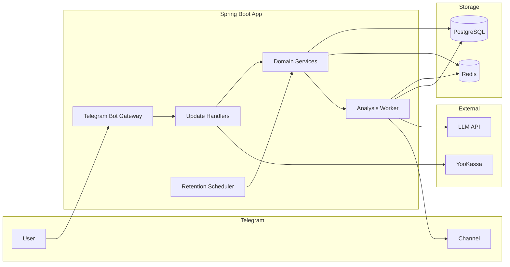
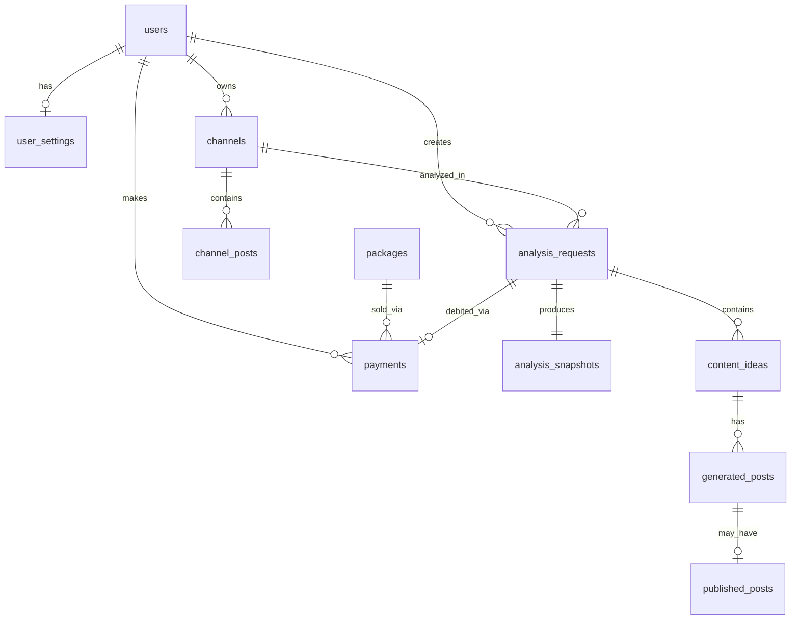
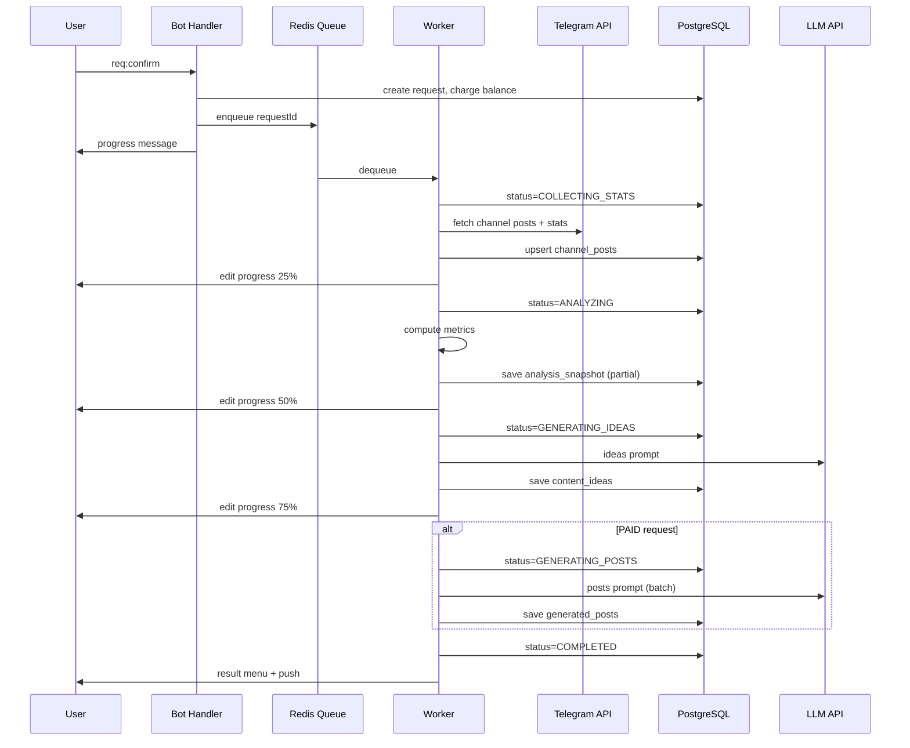

# ChannelPulse AI — Техническое ТЗ v1.0

> Backend: Java 17, Spring Boot 3, PostgreSQL, Redis, Telegram Bot API, LLM.
> Связанные документы: [USER_FLOW.md](./USER_FLOW.md), [PROMPTS.md](./PROMPTS.md)

---

## 1. Архитектура (high-level)



### 1.1. Модули приложения (пакеты)

```
org.example.pulse_ai
├── config/           # Spring, Redis, Telegram, LLM, YooKassa
├── telegram/
│   ├── bot/          # Bot registration, webhook/long-polling
│   ├── handler/      # UpdateHandler, callback router
│   ├── keyboard/     # Reply + Inline keyboards
│   └── sender/       # TelegramMessageSender
├── session/          # UserSession (Redis), BotState
├── domain/
│   ├── user/
│   ├── channel/
│   ├── request/      # AnalysisRequest lifecycle
│   ├── payment/
│   └── publish/
├── stats/            # Channel stats collection + metrics calc
├── ai/               # LLM client, prompt builder, response parser
├── worker/           # Async job processor
├── scheduler/        # Retention cron jobs
└── persistence/      # JPA entities, repositories
```

### 1.2. Режим работы бота

| Режим | MVP | Production |
|-------|-----|------------|
| Telegram updates | Long polling | Webhook (`/api/telegram/webhook`) |
| Async jobs | `@Async` + Redis queue | Redis Stream / dedicated worker pod |
| Migrations | Flyway | Flyway |

---

## 2. PostgreSQL — схема БД

### 2.1. ER-диаграмма



---

### 2.2. Таблица `users`

| Колонка | Тип | Описание |
|---------|-----|----------|
| `id` | BIGSERIAL PK | Internal ID |
| `telegram_id` | BIGINT UNIQUE NOT NULL | Telegram user ID |
| `username` | VARCHAR(255) | @username |
| `first_name` | VARCHAR(255) | |
| `last_name` | VARCHAR(255) | |
| `language_code` | VARCHAR(10) | `ru` default |
| `balance` | INT NOT NULL DEFAULT 0 | Остаток запросов |
| `free_analysis_used` | BOOLEAN NOT NULL DEFAULT FALSE | Бесплатный hook |
| `total_requests` | INT NOT NULL DEFAULT 0 | Счётчик для retention |
| `total_ideas_received` | INT NOT NULL DEFAULT 0 | Счётчик для retention |
| `total_posts_published` | INT NOT NULL DEFAULT 0 | |
| `active_channel_id` | BIGINT FK → channels | Текущий канал (MVP: 1) |
| `created_at` | TIMESTAMPTZ NOT NULL | |
| `updated_at` | TIMESTAMPTZ NOT NULL | |
| `last_active_at` | TIMESTAMPTZ | |

**Индексы:** `telegram_id`, `last_active_at`

---

### 2.3. Таблица `user_settings`

| Колонка | Тип | Описание |
|---------|-----|----------|
| `user_id` | BIGINT PK FK → users | |
| `notifications_enabled` | BOOLEAN DEFAULT TRUE | Retention push |
| `timezone` | VARCHAR(64) DEFAULT 'Europe/Moscow' | Для «лучшего времени» |

---

### 2.4. Таблица `channels`

| Колонка | Тип | Описание |
|---------|-----|----------|
| `id` | BIGSERIAL PK | |
| `telegram_chat_id` | BIGINT UNIQUE NOT NULL | Channel chat ID |
| `username` | VARCHAR(255) | @channel без @ |
| `title` | VARCHAR(512) NOT NULL | |
| `subscriber_count` | INT | Snapshot при подключении |
| `owner_user_id` | BIGINT FK → users | |
| `bot_is_admin` | BOOLEAN NOT NULL DEFAULT FALSE | |
| `can_post_messages` | BOOLEAN NOT NULL DEFAULT FALSE | |
| `can_view_stats` | BOOLEAN NOT NULL DEFAULT FALSE | |
| `connection_status` | VARCHAR(32) NOT NULL | `ACTIVE`, `DISCONNECTED`, `LIMITED` |
| `last_sync_at` | TIMESTAMPTZ | Последний сбор постов |
| `created_at` | TIMESTAMPTZ NOT NULL | |
| `updated_at` | TIMESTAMPTZ NOT NULL | |

**Индексы:** `owner_user_id`, `telegram_chat_id`

---

### 2.5. Таблица `channel_posts`

Кэш постов канала для анализа (обновляется при каждом запросе).

| Колонка | Тип | Описание |
|---------|-----|----------|
| `id` | BIGSERIAL PK | |
| `channel_id` | BIGINT FK → channels | |
| `telegram_message_id` | INT NOT NULL | |
| `published_at` | TIMESTAMPTZ NOT NULL | |
| `text_preview` | VARCHAR(500) | Первые 500 символов |
| `full_text` | TEXT | Полный текст |
| `views` | INT | |
| `forwards` | INT | |
| `reactions_total` | INT | Сумма реакций |
| `replies_count` | INT | Комментарии (если доступны) |
| `engagement_rate` | DECIMAL(6,4) | ER = (reactions+forwards+replies) / views |
| `media_type` | VARCHAR(32) | `text`, `photo`, `video`, `poll` |
| `collected_at` | TIMESTAMPTZ NOT NULL | |

**Unique:** `(channel_id, telegram_message_id)`
**Индексы:** `(channel_id, published_at DESC)`, `(channel_id, views DESC)`

---

### 2.6. Таблица `packages`

Seed-данные, не меняются пользователем.

| Колонка | Тип | Описание |
|---------|-----|----------|
| `id` | SMALLSERIAL PK | |
| `code` | VARCHAR(32) UNIQUE | `START`, `CONTENT`, `PRO` |
| `name` | VARCHAR(64) | Старт / Контент / Про |
| `request_count` | INT NOT NULL | 10 / 18 / 30 |
| `price_rub` | INT NOT NULL | 990 / 1600 / 2300 |
| `stars_amount` | INT | Эквивалент в Stars |
| `is_active` | BOOLEAN DEFAULT TRUE | |
| `sort_order` | SMALLINT | |

**Seed:**

```sql
INSERT INTO packages (code, name, request_count, price_rub, stars_amount, sort_order) VALUES
('START',   'Старт',   10,  990,  500,  1),
('CONTENT', 'Контент', 18, 1600,  800,  2),
('PRO',     'Про',     30, 2300, 1150,  3);
```

---

### 2.7. Таблица `analysis_requests`

Центральная сущность — один «запрос» пользователя.

| Колонка | Тип | Описание |
|---------|-----|----------|
| `id` | BIGSERIAL PK | Request # для UI |
| `user_id` | BIGINT FK → users | |
| `channel_id` | BIGINT FK → channels | |
| `type` | VARCHAR(16) NOT NULL | `FREE`, `PAID` |
| `status` | VARCHAR(32) NOT NULL | см. §2.7.1 |
| `period_from` | DATE NOT NULL | Начало окна анализа |
| `period_to` | DATE NOT NULL | Конец (обычно today) |
| `progress_percent` | SMALLINT DEFAULT 0 | 0–100 для UI |
| `progress_stage` | VARCHAR(64) | Текущий этап pipeline |
| `balance_charged` | BOOLEAN DEFAULT FALSE | Списан ли запрос |
| `error_message` | TEXT | При FAILED |
| `telegram_status_message_id` | INT | Message ID для edit progress |
| `started_at` | TIMESTAMPTZ | |
| `completed_at` | TIMESTAMPTZ | |
| `created_at` | TIMESTAMPTZ NOT NULL | |

**Индексы:** `(user_id, created_at DESC)`, `(status)`, `(channel_id)`

#### 2.7.1. Статусы `analysis_requests.status`

```
PENDING → COLLECTING_STATS → ANALYZING → GENERATING_IDEAS → GENERATING_POSTS → COMPLETED
                                                                              ↘ FAILED
Any active → CANCELLED (только admin/debug)
```

| Status | Описание |
|--------|----------|
| `PENDING` | В очереди |
| `COLLECTING_STATS` | Сбор постов из Telegram |
| `ANALYZING` | Расчёт метрик |
| `GENERATING_IDEAS` | LLM: идеи |
| `GENERATING_POSTS` | LLM: посты (только PAID) |
| `COMPLETED` | Готово |
| `FAILED` | Ошибка + refund если charged |

---

### 2.8. Таблица `analysis_snapshots`

JSON-сnapshot аналитики (1:1 с request).

| Колонка | Тип | Описание |
|---------|-----|----------|
| `request_id` | BIGINT PK FK → analysis_requests | |
| `avg_views` | INT | |
| `avg_engagement_rate` | DECIMAL(6,4) | |
| `views_delta_percent` | DECIMAL(6,2) | vs предыдущий период |
| `post_count` | INT | |
| `best_publish_slots` | JSONB | `[{day, time, er}]` |
| `avoid_slots` | JSONB | |
| `top_posts` | JSONB | `[{messageId, title, views, er, ...}]` |
| `worst_posts` | JSONB | + `reason` (LLM или rule-based) |
| `working_topics` | JSONB | `[{topic, avgEr, postCount}]` |
| `frequency_recommendation` | VARCHAR(255) | |
| `raw_metrics` | JSONB | Полный дамп для debug |
| `created_at` | TIMESTAMPTZ NOT NULL | |

---

### 2.9. Таблица `content_ideas`

| Колонка | Тип | Описание |
|---------|-----|----------|
| `id` | BIGSERIAL PK | |
| `request_id` | BIGINT FK → analysis_requests | |
| `sort_order` | SMALLINT NOT NULL | 1..12 |
| `title` | VARCHAR(512) NOT NULL | |
| `reason` | TEXT NOT NULL | Обоснование |
| `format` | VARCHAR(64) | `longread`, `короткий`, `опрос`, … |
| `suggested_day` | VARCHAR(32) | `Понедельник`, `Ср–Чт`, … |
| `created_at` | TIMESTAMPTZ NOT NULL | |

**Индекс:** `(request_id, sort_order)`

---

### 2.10. Таблица `generated_posts`

| Колонка | Тип | Описание |
|---------|-----|----------|
| `id` | BIGSERIAL PK | |
| `request_id` | BIGINT FK → analysis_requests | |
| `idea_id` | BIGINT FK → content_ideas | |
| `sort_order` | SMALLINT NOT NULL | 1..7 |
| `variant_a` | TEXT NOT NULL | |
| `variant_b` | TEXT | |
| `variant_c` | TEXT | Опционально |
| `headlines` | JSONB | `["...", "..."]` |
| `cta` | VARCHAR(512) | |
| `created_at` | TIMESTAMPTZ NOT NULL | |

---

### 2.11. Таблица `published_posts`

| Колонка | Тип | Описание |
|---------|-----|----------|
| `id` | BIGSERIAL PK | |
| `generated_post_id` | BIGINT FK → generated_posts | |
| `user_id` | BIGINT FK → users | |
| `channel_id` | BIGINT FK → channels | |
| `variant_used` | CHAR(1) | `A`, `B`, `C`, `EDITED` |
| `final_text` | TEXT NOT NULL | Текст после edit |
| `telegram_message_id` | INT | ID опубликованного поста |
| `post_link` | VARCHAR(512) | `t.me/channel/123` |
| `published_at` | TIMESTAMPTZ NOT NULL | |

---

### 2.12. Таблица `payments`

| Колонка | Тип | Описание |
|---------|-----|----------|
| `id` | BIGSERIAL PK | |
| `user_id` | BIGINT FK → users | |
| `package_id` | SMALLINT FK → packages | |
| `provider` | VARCHAR(32) NOT NULL | `STARS`, `YOOKASSA` |
| `external_id` | VARCHAR(255) | ID в провайдере |
| `amount_rub` | INT NOT NULL | С учётом скидки |
| `discount_percent` | SMALLINT DEFAULT 0 | |
| `promo_code` | VARCHAR(64) | `first_10`, `return_5` |
| `status` | VARCHAR(32) NOT NULL | `PENDING`, `SUCCEEDED`, `CANCELLED`, `FAILED` |
| `requests_credited` | INT | Сколько начислено |
| `metadata` | JSONB | Payload провайдера |
| `created_at` | TIMESTAMPTZ NOT NULL | |
| `completed_at` | TIMESTAMPTZ | |

**Индексы:** `(user_id, created_at DESC)`, `(external_id)`, `(status)`

---

### 2.13. Таблица `balance_transactions`

Audit log изменений баланса.

| Колонка | Тип | Описание |
|---------|-----|----------|
| `id` | BIGSERIAL PK | |
| `user_id` | BIGINT FK → users | |
| `delta` | INT NOT NULL | +18 / -1 |
| `balance_after` | INT NOT NULL | |
| `reason` | VARCHAR(64) | `PAYMENT`, `REQUEST_CHARGE`, `REFUND`, `ADMIN` |
| `reference_id` | BIGINT | payment_id или request_id |
| `created_at` | TIMESTAMPTZ NOT NULL | |

---

### 2.14. Таблица `scheduled_notifications`

Очередь retention-сообщений.

| Колонка | Тип | Описание |
|---------|-----|----------|
| `id` | BIGSERIAL PK | |
| `user_id` | BIGINT FK → users | |
| `type` | VARCHAR(64) | `LOW_BALANCE`, `ZERO_BALANCE`, `REFRESH_7D`, `INACTIVE_14D` |
| `scheduled_at` | TIMESTAMPTZ NOT NULL | |
| `sent_at` | TIMESTAMPTZ | |
| `cancelled` | BOOLEAN DEFAULT FALSE | |

**Unique partial:** `(user_id, type) WHERE sent_at IS NULL AND cancelled = FALSE`

---

## 3. Redis

### 3.1. Keys

| Key | TTL | Тип | Назначение |
|-----|-----|-----|------------|
| `session:{telegramId}` | 24h | Hash | BotState, context (requestId, postId, edit draft) |
| `lock:user:{userId}` | 30s | String | Mutex: один активный request |
| `lock:channel:{channelId}` | 60s | String | Mutex: сбор статистики |
| `job:queue` | — | List | FIFO очередь request IDs |
| `job:processing:{requestId}` | 15m | Hash | stage, startedAt, retryCount |
| `job:dead:{requestId}` | 7d | Hash | Failed jobs для ops |
| `payment:pending:{paymentId}` | 30m | Hash | Stars/YooKassa in-flight |
| `rate:llm:user:{userId}` | 1h | Counter | Max 5 requests/hour |
| `cache:channel:{channelId}:posts` | 1h | String (JSON) | Hot cache последних постов |

### 3.2. Session hash fields

```
state          → MAIN_MENU | REQUEST_RUNNING | POST_EDIT | ...
channel_id     → internal channel id
request_id     → текущий request (navigation)
post_id        → текущий generated_post
edit_draft     → текст при редактировании
payment_id     → pending payment
message_id     → last bot message for edit
updated_at     → epoch ms
```

### 3.3. Очередь jobs

**Enqueue (после `req:confirm`):**

```
LPUSH job:queue {requestId}
```

**Worker loop:**

```
BRPOP job:queue 5
→ SET lock:user:{userId} NX EX 30
→ process pipeline
→ DEL lock:user:{userId}
```

**Retry policy:** max 2 retries на LLM timeout; exponential backoff 5s, 15s.

---

## 4. Async Pipeline

### 4.1. Диаграмма



### 4.2. Этапы pipeline (детали)

#### Stage 1: `CollectStatsService`

**Input:** `channelId`, `periodFrom`, `periodTo`

**Actions:**
1. Verify bot still admin (`getChatMember`)
2. Fetch messages via `getUpdates` history / forward from channel (Bot API: iterate known message IDs or use channel post export strategy)
3. For each post: views, reactions (`getMessage` or channel statistics API where available)
4. Upsert `channel_posts`
5. Min 10 posts check → flag `limitedAnalysis` in job context

**Output:** `List<ChannelPost>`, `limitedAnalysis: boolean`

> **Note:** Telegram не даёт полный history через Bot API напрямую. MVP-стратегии (выбрать одну при реализации):
> - A) Хранить посты с момента подключения бота (накопительный кэш)
> - B) User forwards 20–30 постов при первом подключении (fallback)
> - C) TDLib sidecar (post-MVP)

#### Stage 2: `AnalyticsService`

**Pure Java**, без LLM.

**Calculations:**
- `avgViews`, `avgER`, `viewsDeltaPercent` (vs previous 30d window)
- Top N / Worst N by weighted score: `score = views * 0.6 + er * 1000 * 0.4`
- Best publish slots: group by `(dayOfWeek, hourBucket)` → avg ER
- Topic extraction: keyword clustering или TF-IDF по `full_text` (MVP: top-5 n-grams)
- Worst post reasons: rule-based (`low views + below avg ER + short text`)

**Output:** `AnalysisSnapshot` (partial, без LLM reasons)

#### Stage 3: `IdeasGenerationService`

**Input:** snapshot + top/worst posts texts + channel metadata

**LLM:** см. [PROMPTS.md §1](./PROMPTS.md)

**Output:** 3 ideas (FREE) или 8–12 (PAID)

#### Stage 4: `PostsGenerationService` (PAID only)

**Input:** ideas + 5–10 best posts as style samples

**LLM:** см. [PROMPTS.md §2](./PROMPTS.md)

**Output:** 5–7 `generated_posts` with variants

#### Stage 5: `NotifyUserService`

- Edit progress message → final или отправить новое
- Inline keyboard `result:menu:{reqId}`
- Update `users.total_ideas_received`

### 4.3. Refund logic

```java
if (request.isBalanceCharged() && request.getStatus() == FAILED) {
    userService.credit(userId, 1, REFUND, requestId);
    request.setBalanceCharged(false);
}
```

Trigger: LLM fail after 2 retries, unrecoverable Telegram error, worker timeout (>10 min).

---

## 5. Domain Services (internal API)

Не REST для пользователя — сервисный слой, вызываемый handlers/worker.

### 5.1. `UserService`

| Method | Описание |
|--------|----------|
| `findOrCreate(telegramUser)` | Upsert по `telegram_id` |
| `getBalance(userId)` | |
| `chargeRequest(userId, requestId)` | -1, log transaction, throw if balance < 1 |
| `credit(userId, amount, reason, refId)` | +N после оплаты / refund |
| `markFreeAnalysisUsed(userId)` | |

### 5.2. `ChannelService`

| Method | Описание |
|--------|----------|
| `connect(userId, chatId / forward)` | Verify admin, save channel |
| `verifyBotAccess(channelId)` | Re-check permissions |
| `disconnect(channelId)` | Status → DISCONNECTED |
| `syncSubscriberCount(channelId)` | |

### 5.3. `AnalysisRequestService`

| Method | Описание |
|--------|----------|
| `startFree(userId, channelId)` | type=FREE, no charge |
| `startPaid(userId, channelId)` | charge + enqueue |
| `getByIdForUser(requestId, userId)` | Authorization check |
| `updateProgress(requestId, stage, percent)` | |
| `complete(requestId)` / `fail(requestId, error)` | |

### 5.4. `PublishService`

| Method | Описание |
|--------|----------|
| `preview(postId, variant)` | Load text |
| `updateDraft(session, text)` | Validate ≤4096 |
| `publish(userId, postId, finalText)` | `sendMessage` to channel chat_id |
| `savePublishedRecord(...)` | |

### 5.5. `PaymentService`

| Method | Описание |
|--------|----------|
| `createPending(userId, packageCode, provider, promo?)` | |
| `handleStarsPayment(successfulPayment)` | Credit balance |
| `handleYooKassaWebhook(payload)` | Verify signature, credit |
| `applyPromo(code, packageId)` | `first_10` → -10%, `return_5` → -5% |

---

## 6. Telegram Handler Map

Маппинг callback → handler (router по префиксу).

| Prefix | Handler | Key methods |
|--------|---------|-------------|
| `menu:` | `MenuHandler` | `main`, `howItWorks`, `whatInRequest` |
| `channel:` | `ChannelHandler` | `connect`, `connectLimited` |
| `req:` | `RequestHandler` | `free`, `start`, `confirm` |
| `result:` | `ResultHandler` | `analytics`, `ideas`, `posts`, `timing`, `menu` |
| `idea:` | `ResultHandler` | paginate ideas |
| `post:` | `PostHandler` | view, edit |
| `publish:` | `PublishHandler` | `confirm`, `edit` |
| `pay:` | `PaymentHandler` | `select`, `pack`, `method` |
| `hist:` | `HistoryHandler` | `list`, `{id}` |
| `set:` | `SettingsHandler` | `notify:toggle` |

### 6.1. Text message routing (by BotState)

| State | Text input → |
|-------|--------------|
| `CONNECT_CHANNEL` | `ChannelService.connect(forward/username)` |
| `POST_EDIT` | Save draft → POST_PREVIEW |
| `PAYMENT_PROCESSING` | Ignore + «Дождитесь оплаты» |
| `REQUEST_RUNNING` | «Анализ ещё идёт» |
| default | Match reply keyboard / commands |

---

## 7. External HTTP API (webhooks)

### 7.1. `POST /api/telegram/webhook`

Telegram Update JSON → `UpdateHandler.handle(update)`

**Security:** secret token header `X-Telegram-Bot-Api-Secret-Token`

### 7.2. `POST /api/payments/yookassa/webhook`

YooKassa notification → `PaymentService.handleYooKassaWebhook`

**Security:** IP allowlist + signature verification

### 7.3. `GET /actuator/health`

Spring Actuator для деплоя.

---

## 8. LLM Integration

### 8.1. Provider abstraction

```java
public interface LlmClient {
    LlmResponse complete(LlmRequest request);
}

public record LlmRequest(
    String model,
    String systemPrompt,
    String userPrompt,
    int maxTokens,
    double temperature,
    Optional<String> jsonSchema
) {}
```

**MVP provider:** OpenAI-compatible API (GPT-4o) или Anthropic (Claude 3.5 Sonnet).

**Config:**

```yaml
pulse.ai.llm:
  provider: openai          # openai | anthropic
  model: gpt-4o
  max-retries: 2
  timeout: 60s
  temperature-ideas: 0.7
  temperature-posts: 0.8
```

### 8.2. Response parsing

- Все LLM-ответы — **strict JSON** (см. PROMPTS.md)
- Parser: Jackson → validate schema → save entities
- On parse error: retry with «fix JSON» prompt once

### 8.3. Cost control

| Request type | ~Input tokens | ~Output tokens | Calls |
|--------------|---------------|----------------|-------|
| FREE ideas | 3K | 800 | 1 |
| PAID ideas | 4K | 2K | 1 |
| PAID posts | 6K | 4K | 1–2 (batch 7 posts) |

**Rate limit:** 5 LLM calls / user / hour (Redis counter).

---

## 9. Payments

### 9.1. Telegram Stars

1. `sendInvoice` с `currency=XTR`, `provider_token=""` 
2. `precheckout_query` → answer ok
3. `successful_payment` → `PaymentService.handleStarsPayment`

**Mapping Stars ↔ packages:** из таблицы `packages.stars_amount`.

### 9.2. YooKassa

1. Create payment via REST API → redirect URL в inline button (`url`)
2. Webhook `payment.succeeded` → credit balance
3. Store `external_id` = YooKassa payment ID

### 9.3. Promo codes (MVP)

| Code | Условие | Скидка |
|------|---------|--------|
| `first_10` | Первая покупка | 10% |
| `return_5` | balance=0, total_requests≥1 | 5% |

---

## 10. Scheduler (Retention)

| Job | Cron | Logic |
|-----|------|-------|
| `LowBalanceNotifier` | daily 10:00 MSK | balance==1, not notified |
| `ZeroBalanceNotifier` | daily 11:00 MSK | balance==0, last request >24h |
| `RefreshAnalysisNotifier` | daily 12:00 MSK | last request >7d, balance>0 |
| `InactiveUserNotifier` | daily 13:00 MSK | 14d inactive, free used, no purchase |
| `ChannelHealthCheck` | every 6h | verify bot admin on active channels |
| `StaleJobRecovery` | every 15m | requeue jobs stuck >10m |

---

## 11. Конфигурация (`application.yaml`)

```yaml
spring:
  datasource:
    url: jdbc:postgresql://localhost:5432/channelpulse
  data:
    redis:
      host: localhost
      port: 6379
  jpa:
    hibernate:
      ddl-auto: validate
  flyway:
    enabled: true

telegram:
  bot:
    token: ${TELEGRAM_BOT_TOKEN}
    username: ChannelPulseBot
    webhook-path: /api/telegram/webhook
    mode: polling  # polling | webhook

pulse:
  analysis:
    period-days: 30
    min-posts-full: 10
    min-posts-free: 3
  ai:
    provider: openai
    model: gpt-4o
  payments:
    yookassa:
      shop-id: ${YOOKASSA_SHOP_ID}
      secret-key: ${YOOKASSA_SECRET_KEY}
```

---

## 12. Gradle dependencies (target)

```gradle
dependencies {
    implementation 'org.springframework.boot:spring-boot-starter'
    implementation 'org.springframework.boot:spring-boot-starter-data-jpa'
    implementation 'org.springframework.boot:spring-boot-starter-data-redis'
    implementation 'org.springframework.boot:spring-boot-starter-web'
    implementation 'org.springframework.boot:spring-boot-starter-actuator'
    implementation 'org.flywaydb:flyway-core'
    implementation 'org.telegram:telegrambots-spring-boot-starter:6.9.7.1'
    implementation 'com.fasterxml.jackson.core:jackson-databind'
    runtimeOnly 'org.postgresql:postgresql'
    compileOnly 'org.projectlombok:lombok'
    annotationProcessor 'org.projectlombok:lombok'
}
```

---

## 13. Flyway migrations (порядок)

| Version | File | Содержание |
|---------|------|------------|
| V1 | `V1__init_users_channels.sql` | users, user_settings, channels |
| V2 | `V2__posts_requests.sql` | channel_posts, analysis_requests |
| V3 | `V3__analysis_content.sql` | snapshots, ideas, generated_posts, published_posts |
| V4 | `V4__payments.sql` | packages (seed), payments, balance_transactions |
| V5 | `V5__notifications.sql` | scheduled_notifications |

---

## 14. Безопасность

| Область | Мера |
|---------|------|
| User data | Request access only by `user_id` match |
| Payments | Idempotent webhook handling by `external_id` |
| Secrets | Env vars, не в git |
| LLM prompts | Не логировать full post texts в production |
| Rate limiting | Redis counters на userId |
| Input | Sanitize user edit text, max 4096 chars |

---

## 15. Observability

| Metric | Тип | Labels |
|--------|-----|--------|
| `analysis_requests_total` | Counter | status, type |
| `analysis_duration_seconds` | Histogram | type |
| `llm_calls_total` | Counter | stage, success |
| `payments_total` | Counter | provider, status |
| `publish_total` | Counter | success |

**Logging:** structured JSON; correlation ID = `requestId`.

---

## 16. MVP scope checklist

| Component | MVP | Post-MVP |
|-----------|-----|----------|
| Channel stats source | Cache since connect + forward fallback | TDLib full history |
| LLM style memory | Top posts as few-shot in prompt | Persistent tone profile |
| Competitor analysis | ❌ | ✅ |
| Scheduled publish | ❌ | ✅ |
| Multi-channel per user | ❌ | ✅ |
| Google Sheets export | ❌ | ✅ |
| **Auto-scout (internal)** | ❌ | ✅ [SCOUT_MODULE.md](./SCOUT_MODULE.md) |

---

## 17. Internal: Auto-scout (Module D)

Отдельный модуль **только для владельца** — не входит в MVP для пользователей.

- **Outreach:** 2–4 user-аккаунта (MTProto), ежедневный поиск каналов 5–50k, ЛС владельцам, антиспам, SpamBot.
- **Observer:** 2–4 аккаунта, пассивная разведка в чатах, LLM → база ниш.
- **Learning loop:** исходы диалогов → scoring шаблонов → подсказки ответов владельцу.

Полное ТЗ, схема БД, фазы D0–D6: **[SCOUT_MODULE.md](./SCOUT_MODULE.md)**.

---

*Документ: ChannelPulse AI Technical Spec v1.0 · Июль 2026*
