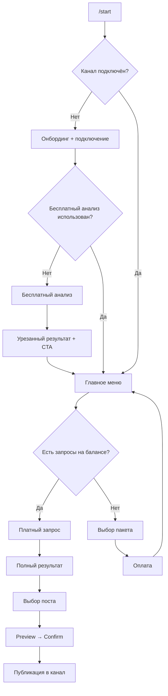

# ChannelPulse AI — User Flow v1.0

> Детальная спецификация UX бота: состояния, экраны, тексты, callback-кнопки, edge cases.
> Основано на ТЗ v1.0 (Июль 2026).

---

## 1. Состояния бота (BotState)

```java
public enum BotState {
    MAIN_MENU,                  // Главное меню
    CONNECT_CHANNEL,            // Ожидание подключения канала
    CHANNEL_CONNECTED,          // Канал подключён, можно делать запросы
    FREE_ANALYSIS_RUNNING,      // Бесплатный анализ в процессе
    FREE_ANALYSIS_RESULT,       // Результат бесплатного анализа
    REQUEST_RUNNING,            // Платный запрос в процессе
    REQUEST_RESULT,             // Результат платного запроса (навигация по блокам)
    VIEW_IDEAS,                 // Просмотр идей контента
    VIEW_POSTS,                 // Просмотр сгенерированных постов
    POST_PREVIEW,               // Превью одного поста перед публикацией
    POST_EDIT,                  // Редактирование текста поста
    POST_CONFIRM,               // Подтверждение публикации
    PAYMENT_SELECT,             // Выбор пакета
    PAYMENT_PROCESSING,         // Ожидание оплаты
    HISTORY_LIST,               // Список прошлых запросов
    HISTORY_DETAIL,             // Детали одного запроса из истории
    SETTINGS                    // Настройки (канал, уведомления)
}
```

---

## 2. Глобальная навигация

### Reply-клавиатура (постоянная, после онбординга)

| Кнопка | Действие |
|--------|----------|
| 📊 Новый запрос | Запуск платного анализа (если есть баланс) |
| 📁 История | Список прошлых запросов |
| 💳 Купить запросы | Выбор пакета |
| ⚙️ Настройки | Канал, уведомления |
| ℹ️ Помощь | FAQ |

### Callback-префиксы (inline-кнопки)

| Префикс | Назначение | Пример |
|---------|------------|--------|
| `menu:` | Навигация по меню | `menu:main` |
| `channel:` | Подключение канала | `channel:connect` |
| `req:` | Запросы | `req:start`, `req:free` |
| `result:` | Навигация по результату | `result:analytics`, `result:ideas`, `result:posts` |
| `idea:` | Идея контента | `idea:3` |
| `post:` | Пост | `post:3:2` (идея 3, вариант 2) |
| `publish:` | Автопостинг | `publish:confirm`, `publish:cancel` |
| `pay:` | Платежи | `pay:pack:18`, `pay:method:stars` |
| `hist:` | История | `hist:42`, `hist:42:posts` |
| `set:` | Настройки | `set:channel`, `set:notify:on` |

---

## 3. Диаграмма основного пути



---

## 4. Экраны и сообщения

---

### 4.1. `/start` — Первый запуск

**Триггер:** команда `/start` (новый пользователь)

**Сообщение:**

```
👋 Привет! Я ChannelPulse AI

Я анализирую ваш Telegram-канал и генерирую готовые посты — в стиле именно вашего канала, на основе реальной статистики.

Что вы получите за 1 запрос:
• Анализ топ/худших постов и лучшего времени публикации
• 8–12 идей контента с обоснованием
• 5–7 готовых постов с заголовками и CTA

🎁 Первый анализ — бесплатно. Подключите канал и попробуйте.
```

**Inline-кнопки:**

| Текст | callback_data |
|-------|---------------|
| 🔗 Подключить канал | `channel:connect` |
| ℹ️ Как это работает | `menu:how_it_works` |

**BotState →** `CONNECT_CHANNEL`

---

### 4.2. «Как это работает»

**Триггер:** callback `menu:how_it_works`

**Сообщение:**

```
ℹ️ Как работает ChannelPulse AI

1️⃣ Добавьте бота администратором в канал (нужны права на публикацию и просмотр статистики)
2️⃣ Бот проанализирует ваши посты за последние 30 дней
3️⃣ Вы получите аналитику, идеи и готовые тексты
4️⃣ Выберите пост → подтвердите → бот опубликует в канал

⏱ Анализ занимает 1–3 минуты.
💰 Дальше — пакеты: 10 / 18 / 30 запросов.
```

**Inline-кнопки:**

| Текст | callback_data |
|-------|---------------|
| 🔗 Подключить канал | `channel:connect` |
| ◀️ Назад | `menu:main` |

---

### 4.3. Подключение канала

**Триггер:** callback `channel:connect` или кнопка «⚙️ Настройки → Канал»

**Сообщение:**

```
🔗 Подключение канала

Сделайте 2 шага:

1. Добавьте @ChannelPulseBot администратором в ваш канал
   ✅ Право «Публикация сообщений»
   ✅ Право «Доступ к статистике канала» (если доступно)

2. Перешлите сюда любой пост из канала
   или отправьте ссылку: @your_channel

⚠️ Канал должен быть публичным или бот — его админ.
```

**BotState →** `CONNECT_CHANNEL`

**Ожидаемый ввод пользователя:**
- Forward поста из канала
- Username канала (`@channel` или `t.me/channel`)

---

### 4.4. Канал подключён — успех

**Триггер:** бот получил forward / username, проверил права

**Сообщение:**

```
✅ Канал подключён!

📢 {channel_title}
👥 {subscribers_count} подписчиков
📅 Последний пост: {last_post_date}

Сейчас запущу бесплатный анализ — вы увидите, как работает ChannelPulse.
```

**Inline-кнопки:**

| Текст | callback_data |
|-------|---------------|
| 🚀 Запустить бесплатный анализ | `req:free` |
| ◀️ В меню | `menu:main` |

**BotState →** `CHANNEL_CONNECTED`

---

### 4.5. Ошибки подключения канала

#### 4.5.1. Бот не админ

```
❌ Не удалось подключить канал

Бот не является администратором канала «{channel_title}».

Добавьте @ChannelPulseBot админом с правами:
• Публикация сообщений
• Доступ к статистике
```

**Кнопки:** `🔗 Попробовать снова` → `channel:connect`

#### 4.5.2. Нет прав на статистику

```
⚠️ Канал подключён, но статистика недоступна

Без статистики анализ будет менее точным. Выдайте боту право «Доступ к статистике канала» в настройках админов.

Продолжить с ограниченным анализом?
```

**Кнопки:**
- `✅ Продолжить` → `channel:connect:limited`
- `🔄 Переподключить` → `channel:connect`

#### 4.5.3. Слишком мало постов

```
⚠️ В канале мало постов для анализа

Для качественного разбора нужно минимум 10 постов за последние 30 дней. Сейчас: {post_count}.

Вы можете подключить канал, но рекомендации будут общими. Продолжить?
```

**Кнопки:** `✅ Продолжить` / `◀️ Назад`

#### 4.5.4. Канал не найден

```
❌ Канал не найден

Проверьте username или перешлите пост из канала напрямую.
```

---

### 4.6. Бесплатный анализ — процесс

**Триггер:** callback `req:free` (только 1 раз на аккаунт)

**Сообщение (сразу):**

```
⏳ Анализирую канал «{channel_title}»…

• Собираю статистику постов
• Считаю вовлечённость
• Готовлю рекомендации

Обычно это занимает 1–3 минуты. Я пришлю результат, когда будет готово.
```

**BotState →** `FREE_ANALYSIS_RUNNING`

**Промежуточное обновление (через ~30 сек, edit message):**

```
⏳ Анализ в процессе…

✅ Статистика собрана
🔄 Генерирую рекомендации…
```

---

### 4.7. Бесплатный анализ — результат (урезанный)

**Триггер:** async job завершён

**Сообщение (часть 1 — аналитика, урезанная):**

```
🎁 Бесплатный анализ — «{channel_title}»

📊 Краткая аналитика (30 дней)

🔥 Топ-3 поста по просмотрам:
1. «{post_title_1}» — {views_1} просмотров, ER {er_1}%
2. «{post_title_2}» — {views_2} просмотров, ER {er_2}%
3. «{post_title_3}» — {views_3} просмотров, ER {er_3}%

⏰ Лучшее время публикации: {best_time}

📈 Средние просмотры: {avg_views} (+{growth}% к прошлой неделе)
```

**Сообщение (часть 2 — 3 идеи, не 8–12):**

```
💡 3 идеи для вашего канала (из 12 в полном запросе)

1. {idea_1_title}
   → {idea_1_reason_short}

2. {idea_2_title}
   → {idea_2_reason_short}

3. {idea_3_title}
   → {idea_3_reason_short}

📝 Готовые посты и полный разбор — в платном запросе.
```

**Inline-кнопки:**

| Текст | callback_data |
|-------|---------------|
| 💳 Купить полный запрос | `pay:select` |
| ℹ️ Что входит в запрос | `menu:what_in_request` |
| ◀️ В меню | `menu:main` |

**BotState →** `FREE_ANALYSIS_RESULT`

> **Правило:** бесплатный анализ = 3 идеи без готовых постов, без худших постов, без тем/рубрик, без автопостинга.

---

### 4.8. «Что входит в 1 запрос»

**Триггер:** callback `menu:what_in_request`

**Сообщение:**

```
📦 1 запрос = полный цикл

✅ Анализ канала:
   • Топ и худшие посты
   • Лучшее время публикации
   • Динамика просмотров
   • Работающие темы и рубрики

✅ 8–12 идей контента на 7–14 дней с обоснованием

✅ 5–7 готовых постов:
   • 3–4 варианта текста на идею
   • Заголовки + CTA
   • В вашем стиле

✅ Публикация поста в канал через бота

Пакеты:
• Старт — 10 запросов — 990 ₽
• Контент — 18 запросов — 1 600 ₽ ⭐
• Про — 30 запросов — 2 300 ₽
```

**Кнопки:** `💳 Выбрать пакет` → `pay:select`

---

### 4.9. Главное меню

**Триггер:** callback `menu:main`, `/start` (returning user), после онбординга

**Сообщение:**

```
🏠 Главное меню

📢 Канал: {channel_title}
💰 Баланс: {balance} запросов

Что делаем?
```

**Reply-клавиатура:** (см. раздел 2)

**Inline-кнопки (дополнительно):**

| Текст | callback_data |
|-------|---------------|
| 📊 Новый запрос | `req:start` |
| 📁 История ({history_count}) | `hist:list` |

**BotState →** `MAIN_MENU`

---

### 4.10. Платный запрос — старт

**Триггер:** callback `req:start` или reply «📊 Новый запрос»

#### 4.10.1. Баланс = 0

```
💰 Запросов не осталось

Чтобы сделать новый анализ, купите пакет запросов.

Вы уже сделали {total_requests} запросов и получили {total_ideas} идей контента 🎯
```

**Кнопки:**
- `💳 Купить запросы` → `pay:select`
- `📁 История` → `hist:list`

#### 4.10.2. Баланс > 0 — подтверждение

```
📊 Новый запрос

Канал: {channel_title}
Период анализа: последние 30 дней

Будет списан 1 запрос.
Останется: {balance - 1} запросов.

Запустить?
```

**Кнопки:**
- `✅ Запустить анализ` → `req:confirm`
- `◀️ Отмена` → `menu:main`

---

### 4.11. Платный запрос — процесс

**Триггер:** callback `req:confirm`

**Сообщение:**

```
⏳ Запрос #{request_number} — анализ запущен

Канал: {channel_title}
Списано: 1 запрос · Осталось: {balance}

Этапы:
⬜ Сбор статистики
⬜ Анализ вовлечённости
⬜ Генерация идей
⬜ Написание постов

⏱ Обычно 2–4 минуты.
```

**BotState →** `REQUEST_RUNNING`

**Обновления (edit message, по мере прогресса):**

```
⏳ Запрос #{request_number} — {progress}%

✅ Сбор статистики
✅ Анализ вовлечённости
🔄 Генерация идей…
⬜ Написание постов
```

**При ошибке (timeout / LLM fail):**

```
❌ Не удалось завершить запрос

Запрос не списан — баланс восстановлен.
Причина: {error_reason}

Попробовать снова?
```

**Кнопки:** `🔄 Повторить` → `req:confirm` / `◀️ В меню`

---

### 4.12. Платный запрос — результат (навигация)

**Триггер:** job completed

**Сообщение — оглавление:**

```
✅ Запрос #{request_number} готов!

📢 {channel_title} · {analysis_date}

Выберите раздел:
```

**Inline-кнопки:**

| Текст | callback_data |
|-------|---------------|
| 📊 Аналитика канала | `result:analytics:{req_id}` |
| 💡 Идеи контента (12) | `result:ideas:{req_id}` |
| 📝 Готовые посты (7) | `result:posts:{req_id}` |
| ⏰ Лучшее время | `result:timing:{req_id}` |
| 📤 Опубликовать пост | `result:publish:{req_id}` |

**BotState →** `REQUEST_RESULT`

---

### 4.13. Блок «Аналитика канала»

**Триггер:** `result:analytics:{req_id}`

**Сообщение (может быть 2–3 части, если длинное):**

```
📊 Аналитика — «{channel_title}»
📅 Период: {date_from} — {date_to}

📈 Динамика
• Средние просмотры: {avg_views} ({delta}% к прошлому периоду)
• Средний ER: {avg_er}%
• Постов за период: {post_count}

🔥 Топ-5 постов
1. «{title}» — {views} 👁 · {reactions} ❤️ · ER {er}%
2. …
5. …

📉 Худшие 3 поста
1. «{title}» — {views} 👁 · ER {er}%
   💡 Почему не зашло: {reason}
2. …
3. …

🏷 Работающие темы
• {topic_1} — {topic_1_avg_er}% ER
• {topic_2} — {topic_2_avg_er}% ER
• {topic_3} — {topic_3_avg_er}% ER
```

**Кнопки:**
- `💡 Идеи →` → `result:ideas:{req_id}`
- `◀️ К результату` → `result:menu:{req_id}`

---

### 4.14. Блок «Идеи контента»

**Триггер:** `result:ideas:{req_id}`

**Сообщение (список, paginated по 4):**

```
💡 Идеи контента — запрос #{request_number}
Страница {page}/{total_pages}

1. {idea_title}
   📌 {idea_reason}
   🎯 Формат: {format} · 📅 Рекомендуем: {suggested_day}

2. …
3. …
4. …
```

**Inline-кнопки:**

| Текст | callback_data |
|-------|---------------|
| {idea_title_short} → посты | `idea:{req_id}:{idea_id}` |
| ▶️ Далее | `result:ideas:{req_id}:page:2` |
| ◀️ Назад | `result:ideas:{req_id}:page:1` |
| 📝 Все посты | `result:posts:{req_id}` |

**BotState →** `VIEW_IDEAS`

---

### 4.15. Блок «Готовые посты»

**Триггер:** `result:posts:{req_id}` или `idea:{req_id}:{idea_id}`

**Сообщение (один пост = одно сообщение):**

```
📝 Пост {post_num}/{total_posts}
💡 Идея: {idea_title}

━━━ Вариант A ━━━
{post_text_a}

━━━ Вариант B ━━━
{post_text_b}

📌 Заголовки:
• {headline_1}
• {headline_2}
• {headline_3}

👉 CTA: {cta_text}
```

**Inline-кнопки:**

| Текст | callback_data |
|-------|---------------|
| 📤 Опубликовать вариант A | `post:{req_id}:{post_id}:a` |
| 📤 Опубликовать вариант B | `post:{req_id}:{post_id}:b` |
| ✏️ Редактировать A | `post:{req_id}:{post_id}:a:edit` |
| ◀️ {prev} / {next} ▶️ | `post:{req_id}:{post_id-1}` / `post:{req_id}:{post_id+1}` |
| ◀️ К результату | `result:menu:{req_id}` |

**BotState →** `VIEW_POSTS`

---

### 4.16. Блок «Лучшее время публикации»

**Триггер:** `result:timing:{req_id}`

**Сообщение:**

```
⏰ Лучшее время публикации

На основе {post_count} постов за 30 дней:

🥇 Лучшие слоты:
• {day_1} {time_1} — средний ER {er_1}%
• {day_2} {time_2} — средний ER {er_2}%
• {day_3} {time_3} — средний ER {er_3}%

🚫 Избегайте:
• {bad_day} {bad_time} — ER падает на {drop}%

💡 Рекомендация: публикуйте {frequency} раз в неделю, чередуя темы {topic_a} и {topic_b}.
```

---

### 4.17. Автопостинг — preview

**Триггер:** `post:{req_id}:{post_id}:{variant}`

**Сообщение:**

```
📤 Публикация в «{channel_title}»

Текст поста:

━━━━━━━━━━━━━━
{final_post_text}
━━━━━━━━━━━━━━

Опубликовать как есть?
```

**Inline-кнопки:**

| Текст | callback_data |
|-------|---------------|
| ✅ Опубликовать | `publish:confirm:{req_id}:{post_id}:{variant}` |
| ✏️ Редактировать | `publish:edit:{req_id}:{post_id}:{variant}` |
| ◀️ Назад | `post:{req_id}:{post_id}` |

**BotState →** `POST_PREVIEW`

---

### 4.18. Автопостинг — редактирование

**Триггер:** `publish:edit:{req_id}:{post_id}:{variant}`

**Сообщение:**

```
✏️ Редактирование поста

Текущий текст:
━━━━━━━━━━━━━━
{current_text}
━━━━━━━━━━━━━━

Отправьте новый текст сообщением.
Или нажмите «Отмена».
```

**Кнопки:** `❌ Отмена` → `post:{req_id}:{post_id}`

**BotState →** `POST_EDIT`

**После получения текста от пользователя →** вернуться к 4.17 с обновлённым текстом.

---

### 4.19. Автопостинг — подтверждение и публикация

**Триггер:** `publish:confirm:{req_id}:{post_id}:{variant}`

**Сообщение (сразу):**

```
⏳ Публикую в «{channel_title}»…
```

**При успехе:**

```
✅ Пост опубликован!

📢 {channel_title}
🔗 {post_link}

Хотите опубликовать ещё один пост из этого запроса?
```

**Кнопки:**
- `📝 Другие посты` → `result:posts:{req_id}`
- `📊 Новый запрос` → `req:start`
- `◀️ В меню` → `menu:main`

**При ошибке:**

```
❌ Не удалось опубликовать

Проверьте, что бот всё ещё админ канала с правом публикации.

Текст поста сохранён — попробуйте снова.
```

**Кнопки:** `🔄 Повторить` / `✏️ Редактировать`

**BotState →** `POST_CONFIRM` → `MAIN_MENU`

---

### 4.20. Покупка пакетов

**Триггер:** callback `pay:select`, reply «💳 Купить запросы», CTA после free analysis

**Сообщение:**

```
💳 Выберите пакет

• 🌱 Старт — 10 запросов — 990 ₽ (~99 ₽/запрос)
• ⭐ Контент — 18 запросов — 1 600 ₽ (~89 ₽/запрос) — популярный
• 🚀 Про — 30 запросов — 2 300 ₽ (~76 ₽/запрос) — лучшая цена

1 запрос = полный анализ + идеи + готовые посты + публикация
```

**Inline-кнопки:**

| Текст | callback_data |
|-------|---------------|
| 🌱 Старт — 990 ₽ | `pay:pack:10` |
| ⭐ Контент — 1 600 ₽ | `pay:pack:18` |
| 🚀 Про — 2 300 ₽ | `pay:pack:30` |
| ◀️ Назад | `menu:main` |

**BotState →** `PAYMENT_SELECT`

---

### 4.21. Выбор способа оплаты

**Триgger:** `pay:pack:{count}`

**Сообщение:**

```
💳 Оплата: пакет «{pack_name}»
{request_count} запросов · {price} ₽

Выберите способ оплаты:
```

**Inline-кнопки:**

| Текст | callback_data |
|-------|---------------|
| ⭐ Telegram Stars | `pay:method:stars:{count}` |
| 💳 Карта / СБП (YooKassa) | `pay:method:yookassa:{count}` |
| ◀️ Другой пакет | `pay:select` |

---

### 4.22. Оплата — успех

**Триггер:** webhook / successful_payment

**Сообщение:**

```
✅ Оплата прошла!

+{count} запросов на баланс
💰 Баланс: {balance} запросов

Готовы к новому анализу?
```

**Кнопки:**
- `📊 Запустить анализ` → `req:start`
- `◀️ В меню` → `menu:main`

**BotState →** `MAIN_MENU`

---

### 4.23. Оплата — отмена / ошибка

```
❌ Оплата не завершена

Платёж отменён или истёк. Запросы не начислены.

Попробовать снова?
```

**Кнопки:** `💳 Выбрать пакет` / `◀️ В меню`

---

### 4.24. История запросов

**Триггер:** callback `hist:list`, reply «📁 История»

#### Пустая история

```
📁 История запросов

Пока пусто. Сделайте первый анализ — он сохранится здесь.
```

**Кнопки:** `📊 Новый запрос` / `🎁 Бесплатный анализ` (если доступен)

#### Список

```
📁 История запросов

1. #{req_id} · {date} · {channel_title}
   💡 {ideas_count} идей · 📝 {posts_count} постов

2. #{req_id} · {date} · {channel_title}
   …

Показаны последние 10 запросов.
```

**Кнопки (на каждый):** `Открыть #{req_id}` → `hist:{req_id}`

**BotState →** `HISTORY_LIST`

---

### 4.25. Детали запроса из истории

**Триgger:** `hist:{req_id}`

**Сообщение:**

```
📋 Запрос #{req_id}
📅 {date} · 📢 {channel_title}

💡 {ideas_count} идей · 📝 {posts_count} постов
📤 Опубликовано: {published_count} постов
```

**Кнопки:** те же, что в 4.12 (навигация по результату)

**BotState →** `HISTORY_DETAIL`

---

### 4.26. Настройки

**Триггер:** reply «⚙️ Настройки»

**Сообщение:**

```
⚙️ Настройки

📢 Канал: {channel_title} ({subscribers_count} подписчиков)
🔔 Напоминания: {notify_status}
💰 Баланс: {balance} запросов
📊 Всего запросов: {total_requests}
```

**Inline-кнопки:**

| Текст | callback_data |
|-------|---------------|
| 🔄 Сменить канал | `channel:connect` |
| 🔔 Напоминания: вкл/выкл | `set:notify:toggle` |
| 💳 Купить запросы | `pay:select` |
| ◀️ В меню | `menu:main` |

**BotState →** `SETTINGS`

---

### 4.27. Помощь / FAQ

**Триггер:** reply «ℹ️ Помощь»

**Сообщение:**

```
ℹ️ Помощь

❓ Как подключить канал?
→ Настройки → Сменить канал. Добавьте бота админом и перешлите пост.

❓ Что входит в 1 запрос?
→ /what_in_request или кнопка «Что входит в запрос»

❓ Можно ли редактировать пост перед публикацией?
→ Да, на этапе preview нажмите «Редактировать».

❓ Бот не видит статистику?
→ Выдайте право «Доступ к статистике канала» в админах канала.

❓ Вопрос не решился?
→ Напишите @support_username
```

---

## 5. Retention-сообщения (push от бота)

### 5.1. Заканчиваются запросы (осталось 1)

**Триггер:** после списания, balance == 1

```
⚠️ Остался 1 запрос

После него анализ будет недоступен, пока не купите пакет.
```

**Кнопка:** `💳 Купить запросы`

---

### 5.2. Запросы закончились

**Триgger:** balance == 0, cron +24h после последнего запроса

```
👋 Запросы закончились

За это время вы:
• Сделали {total_requests} анализов
• Получили {total_ideas} идей
• Опубликовали {published_count} постов

Продолжим? Пакет «Контент» — 18 запросов за 1 600 ₽.
```

**Кнопки:** `💳 Купить со скидкой 5%` → `pay:pack:18:promo` / `◀️ Позже`

---

### 5.3. Напоминание «пора обновить анализ»

**Тригger:** cron, 7 дней после последнего запроса, balance > 0

```
📊 Пора обновить анализ?

Прошло 7 дней с последнего запроса. Статистика канала могла измениться.

У вас {balance} запросов — запустить новый анализ?
```

**Кнопки:** `📊 Запустить` → `req:start` / `◀️ Не сейчас`

---

### 5.4. Напоминание неактивному пользователю

**Тригger:** 14 дней без активности, free analysis done, balance == 0, no purchase

```
💡 {channel_title} ждёт свежих идей

Вы уже видели бесплатный анализ. Полный запрос даст 12 идей и 7 готовых постов.

🎁 Скидка 10% на первый пакет — только сегодня.
```

**Кнопки:** `💳 Старт — 891 ₽` → `pay:pack:10:promo:first`

---

## 6. Команды бота

| Команда | Действие |
|---------|----------|
| `/start` | Онбординг или главное меню |
| `/menu` | Главное меню |
| `/balance` | Показать баланс + кнопка покупки |
| `/history` | История запросов |
| `/channel` | Подключить / сменить канал |
| `/help` | FAQ |
| `/cancel` | Отмена текущего действия (edit/payment) → main menu |

---

## 7. Правила бизнес-логики

| Правило | Значение |
|---------|----------|
| Бесплатный анализ | 1 раз на аккаунт, 3 идеи, без постов, без publish |
| Списание запроса | При старте job; refund при ошибке |
| Период анализа | 30 дней (MVP) |
| Min постов для full analysis | 10 за 30 дней; иначе warning + general recommendations |
| Max длина поста | 4096 символов (лимит Telegram) |
| История | Все запросы хранятся бессрочно |
| Каналов на аккаунт | 1 (MVP) |
| Очередь | Async; пользователь получает push по завершении |

---

## 8. Матрица: Free vs Paid

| Функция | Free | Paid (1 запрос) |
|---------|------|-----------------|
| Топ посты | 3 | 5 |
| Худшие посты | ❌ | 3 |
| Динамика просмотров | кратко | полная |
| Темы/рубрики | ❌ | ✅ |
| Лучшее время | ✅ | ✅ + рекомендация частоты |
| Идеи | 3 | 8–12 |
| Готовые посты | ❌ | 5–7 (3–4 варианта) |
| Автопостинг | ❌ | ✅ |
| Сохранение в историю | ✅ | ✅ |

---

## 9. Edge cases — сводная таблица

| Ситуация | Поведение бота |
|----------|----------------|
| Пользователь шлёт текст во время GENERATING | «⏳ Анализ ещё идёт, подождите…» |
| Два запроса подряд | «⏳ Дождитесь завершения текущего анализа» |
| Канал отключён (бот удалён) | При любом действии: «⚠️ Канал отключён» + `channel:connect` |
| Free analysis уже использован | `req:free` → «Бесплатный анализ уже был. Купите пакет.» |
| Пост > 4096 символов | «⚠️ Текст слишком длинный (N/4096). Сократите.» |
| Rate limit LLM | Retry 2x, затем refund + извинение |
| Оплата Stars в процессе | `PAYMENT_PROCESSING`, не принимать новые pay callbacks |
| /cancel во время edit | Отмена edit, возврат к preview |

---

## 10. Следующий шаг → Техническое ТЗ

Из этого документа напрямую следуют:

1. **Таблицы БД:** `users`, `channels`, `requests`, `ideas`, `generated_posts`, `published_posts`, `packages`, `payments`, `user_settings`
2. **Redis keys:** `session:{chatId}`, `job:{requestId}`, `lock:channel:{channelId}`
3. **Async pipeline:** `CollectStats → Analyze → GenerateIdeas → GeneratePosts → NotifyUser`
4. **Prompt templates:** отдельный файл `PROMPTS.md`
5. **Roadmap:** 4–6 недель MVP

---

*Документ: ChannelPulse AI User Flow v1.0 · Июль 2026*
